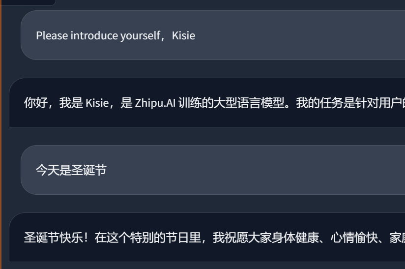

# QWEN-based fine-tuning model: Kisie   

## Background  
openai火遍全网，chatgpt展现出极强的实用价值。  
一直想有一个自己的本地部署的AI助手，所以上网查询了相关资料，希望能自己尝试训练。

## Overview of the work  
因为个人开发资源有限所以我选择以对互联网上已有的开源模型进行微调的方式来实现AI助手的部署

## Process 
1. **选择合适的开源模型**
   - 原先想使用的是meta的llama-7B，因为据说其能力不亚于chatgpt3.5，但是发现官方只“一半开源了模型”，需要企业认证才能下载模型，且不支持中国地区   
   - 对ChatGLM进行部署尝试：ChatGLM是清华大学和智谱AI合作开源的AI模型，支持中英双语，且模型规模小，我的电脑配置也刚好能对其进行简单的微调      
   环境配置+模型下载+文献查询等一系列工作后开始尝试对chatglm-6B进行Lora微调，但是结果不尽人意，其间使用了github上的LLaMA-Factory项目但是可能因为数据集格式或者其他原因难以改变模型的自我认知（Lora微调效果不佳），如下图     
              
   后又尝试使用Freeze方法对原始模型部分参数进行冻结操作，成功实现了模型自我认知的改变，但是由于模型参数较多。训练时间较长且推理回复缓慢，所以又尝试了其他预训练模型   
   - Qwen，来自阿里云的通义千问，支持双语，而且我还找到了数据量更小的Qwen-1.8B，只使用18亿参数规模的模型，可以实现更低成本的部署，如官方介绍“推理最低仅需不到2GB显存，生成2048 tokens仅需3GB显存占用。微调最低仅需6GB。”    

2. **部署与一些成果**
   通过类似的部署，训练与推理，最终成功实现AI助手微调，但是因为预训练模型数据量不大，其知识会有一定的不稳定现象，但是总体令人满意，简单修改了一下各类信息，效果如下   
         
       
       
   随后的训练中又加入了gpt4的一些数据，能够实现绝大多数问答功能  
       
        
   但在一些数学与历史问题上依旧存在不足之处    
   如下面的简单数学问题胡言论语
    
   下面的历史回答时间等有问题
   

3. **后期可能的工作**
    如果后面有时间想要再进一步进行训练与调试，可能会做一些自己继续增添数据集，建立知识库等工作    
    如果要进行全参数等方式训练还需要考虑找合适的算力平台与服务器训练与部署   
    另外也有添加语音交互功能的希望  